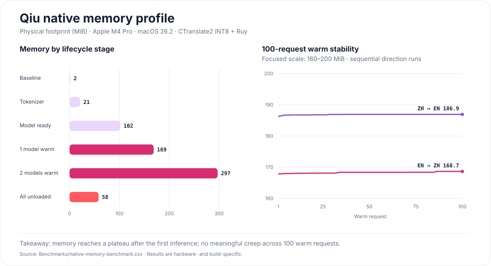

<p align="center">
  
</p>

<h1 align="center">Qiu</h1>

<p align="center">
  A tiny, fast, fully local selection translator for macOS.<br>
  一款轻量、快速、完全本地运行的 macOS 划词翻译工具。
</p>

<p align="center">
  
  
  
  
  <a href="LICENSE"></a>
</p>

<p align="center">
  <a href="#简体中文">简体中文</a> · <a href="#english">English</a> · <a href="https://github.com/Baijia-Yu/Qiu/releases">Releases</a>
</p>

---

## 简体中文

### 为什么做 Qiu？

Qiu 起源于一次没有网络的飞行。

当时我想在飞机上读论文，却发现常用翻译服务都依赖网络。完整的本地大模型虽然能工作，但加载慢、耗电高、占用大，并不适合在笔记本电池供电时随手翻译一句话。

所以我想做一个更小、更直接的工具：按住快捷键，划选文字，松开鼠标，翻译立即出现在光标旁边。没有云端请求，没有历史记录，也不需要为了翻译一句话唤醒一个通用大模型。

### Qiu 的特点

- **自定义触发划词**：可以录制普通按键、Command / Control / Option / Shift 组合，也支持系统能够识别的鼠标侧键或宏按键。按住触发、拖动选择文字、松开鼠标即可翻译。
- **自动判断中英方向**：当前版本会用几乎零开销的 Unicode 规则识别中文与英文，并自动选择 `zh → en` 或 `en → zh` 模型。
- **为翻译而生的小模型**：使用专用 OPUS-MT INT8 模型，不需要为了翻译一句话加载通用大模型。
- **可选 MLX 高质量模式**：Apple Silicon 用户可以添加标准 MLX 模型目录，按翻译方向切换到本地大模型；默认轻量模式不受影响。
- **模型按需加载**：只加载当前方向需要的语言包，warm 时复用，空闲时可以卸载。
- **按需获取官方语言包**：只在用户主动打开目录后联网，可从 Qiu 官方 GitHub Release 下载需要的模型；安装前校验文件大小、SHA-256、包身份与内部清单。
- **可扩展语言包架构**：Qiu 已能发现、验证、选择版本并路由本地语言包，为更多模型部署保留统一接口。
- **Popup 跟着选区走**：翻译窗口根据光标和屏幕边缘自动寻找自然位置，不打断当前阅读。

#### 模型能力状态

| 能力 | 状态 | 说明 |
|---|---|---|
| 内置英文 ↔ 中文模型 | ✅ 已完成 | 完全离线，按方向懒加载 |
| 中英语言方向自动识别 | ✅ 已完成 | 轻量 Unicode heuristic，无额外识别模型 |
| 已安装语言包自动路由 | ✅ 已完成 | 根据语言对选择本地可用版本 |
| 语言包校验与本地导入 | ✅ 已完成 | 验证格式、运行时、路径与必需文件后原子安装 |
| 已安装模型选择界面 | ✅ 已完成 | 英→中、中文→英分别选择，自动回退最高可用版本，重启后保留 |
| Qiu 官方语言包下载 | ✅ 已完成 | 手动读取官方目录，按需下载并校验 SHA-256 后安装 |
| 高级模型管理 | ✅ 已完成 | 查看详情、导入、设为当前模型、预加载、卸载与移除用户语言包 |
| 更多语言自动识别 | 🚧 计划中 | 从中英判断扩展到多语言识别 |
| 自定义模型部署 | ✅ 已完成 | 可导入 Qiu 语言包，也可引用本地 MLX / SafeTensors 模型目录 |
| MLX 本地大模型后端 | ✅ 已完成 | Apple Silicon 可用，按方向选择、懒加载、预加载、卸载且重启后保留 |
| Qiu 审核的 MLX 模型下载 | ✅ 已完成 | 三档 4-bit 模型，固定 revision、显示体积与内存建议，一键下载并校验 |
| 翻译个体适应 | 🚧 计划中 | 基于用户主动确认的术语、译名、纠错与风格偏好进行本地适配，可查看、编辑和清除 |

### 现在能做什么

- 完全离线的英文 → 中文、中文 → 英文翻译
- 自动识别中英文并选择对应翻译方向
- 保留公式中的数学符号、希腊字母、Emoji 和模型词表外的 Unicode 字符
- 按键、组合键或鼠标侧键触发
- Popup 优先：松开鼠标后先显示，再异步读取选区和翻译
- 根据光标与屏幕位置自动放置翻译窗口
- Accessibility API 优先读取选区，不持续轮询
- OPUS-MT INT8、CTranslate2、Ruy 与 Accelerate 原生推理
- 模型按方向懒加载，支持卸载与进程内 LRU 缓存
- 在设置中按翻译方向选择已安装模型，选择会持久保存
- 在设置中按需查看、下载并安装 Qiu 官方语言包
- 本地语言包发现、校验、包身份确认与原子安装
- 在高级模型管理中查看包信息、导入、切换、预加载、卸载和移除用户模型
- 在 Apple Silicon 上添加本地 MLX 模型目录，按方向切换高质量翻译，并查看权重大小、上下文长度与预估内存
- 从 Qiu 的 MLX 模型目录选择轻量、平衡或高质量档，一键下载后离线使用
- 不上传选中文字，不记录翻译历史

### 下载与使用

> [!IMPORTANT]
> 当前 `v0.1.0-alpha.3` 是 Apple Silicon 测试版，尚未使用 Apple Developer ID 签名和公证。macOS 可能阻止首次打开。请只从本仓库的 Releases 下载，并核对 Release 中的说明。

1. 从 [Releases](https://github.com/Baijia-Yu/Qiu/releases) 下载最新 DMG。
2. 打开 DMG，把 Qiu 拖入 Applications。
3. 首次启动若被 Gatekeeper 阻止，请在 Finder 中右键 Qiu →“打开”，或到“系统设置 → 隐私与安全性”确认打开。
4. 按提示授予“辅助功能”和“输入监控”权限。
5. 默认按住 `Control + Option`，划选文字并松开鼠标。

触发键可以在设置中更换，支持普通键、Command / Control / Option / Shift 组合，以及系统能够识别的鼠标按键。

Apple Silicon 用户可在“设置 → MLX 大模型目录”查看 Qiu 审核的模型。下载完成后，在“翻译模型”中为英文→中文或中文→英文选择对应 MLX 模型。高级用户也可以在“高级模型管理”中直接添加自己的标准 MLX / SafeTensors 模型目录。

### 性能与内存

<p align="center">
  
</p>

测试环境：Apple M4 Pro、48 GB 内存、macOS 26.2、arm64、CTranslate2 INT8、Ruy INT8 GEMM、Accelerate FP32 运算。

| 指标 | 实测结果 |
|---|---:|
| 空进程 `phys_footprint` | 1.58 MiB |
| Tokenizer ready | 21.13 MiB |
| 单模型 ready | 101.77 MiB |
| 单模型 warm | 168.67 MiB |
| 双模型 warm | 296.95 MiB |
| 全部 unload 后 | 58.28 MiB |
| 100 次 warm 请求内存增长 | < 1 MiB |
| 100 次后端 warm 翻译 | ≈ 1.95 s（≈ 19.5 ms / request） |

最后一项是原生后端吞吐测试，不等同于“划词 → 选区读取 → Popup 渲染”的端到端延迟。完整原始内存采样位于 [`Benchmarks/native-memory-benchmark.csv`](Benchmarks/native-memory-benchmark.csv)，结果会随硬件、系统和文本变化。

### 工作方式

```text
Control / Option / custom trigger
                ↓
             Mouse Up
                ↓
       pre-created AppKit popup
                ↓
       macOS Accessibility API
                ↓
      language direction heuristic
                ↓
     Swift TranslationEngine protocol
                ↓
       ┌────────┴────────┐
       ↓                 ↓
 Objective-C++        Apple MLX
 SentencePiece        local LLM
 CTranslate2          SafeTensors
       ↓                 ↓
 OPUS-MT INT8      high-quality mode
```

### 隐私

- 翻译推理完全在本机完成。
- 选中文字不会发送给云端翻译服务。
- Qiu 不保存翻译历史。
- 当前模型随 App 或本地语言包提供。
- 用户添加的 MLX 模型只在本机读取；Qiu 保存目录访问权限，不复制、上传或删除原模型文件。
- Qiu 只会在用户主动查看目录、下载语言包或 MLX 模型时联网；该流量只包含目录与模型文件，不包含待翻译文本。
- 未来的个体适应功能只记录用户主动确认的术语与偏好，不把完整翻译历史作为训练数据；适配数据保留在本机并可随时查看、编辑、导出或清除。

Qiu 需要辅助功能和输入监控权限来识别全局触发及读取其他 App 中的选区。这些权限不会改变“翻译在本机完成”的原则。

### 后续计划

- [x] 原生 macOS Menu Bar App
- [x] 英中双向本地翻译
- [x] 中英语言方向自动识别与语言包路由
- [x] 自定义键盘与鼠标触发
- [x] Popup 定位、异步选区与性能埋点
- [x] INT8 原生推理、懒加载与内存生命周期验证
- [x] 本地语言包清单、校验和原子安装
- [x] 按翻译方向选择已安装模型并持久保存
- [x] Qiu 官方审核语言包目录与 App 内按需下载
- [ ] 更多语言对与轻量自动语言识别
- [x] 高级模型管理：查看详情、导入、加载、卸载和移除本地模型
- [x] 自定义 CTranslate2 / Qiu Language Pack 目录导入
- [x] Apple Silicon 可选 MLX 本地大模型翻译后端
- [x] Qiu 审核的 MLX 模型目录、固定版本下载、进度、重试与安全卸载
- [ ] 本地翻译个体适应：术语表、固定译名、领域风格与用户纠错学习
- [ ] Intel / Apple Silicon Universal 发布包
- [ ] 更完整的 Safari、Chrome、PDF 与编辑器兼容性矩阵

### 从源码构建

需要 macOS 15+、Xcode Command Line Tools、CMake、Python 3 和 SentencePiece。打包 Apple Silicon App 时，脚本还会下载固定版本并校验过的 MLX Metal 内核：

```bash
brew install cmake sentencepiece
git clone --recurse-submodules https://github.com/Baijia-Yu/Qiu.git
cd Qiu
./Tools/build_native.sh
./Tools/prepare_models.sh
swift test
./Tools/package_app.sh
```

`prepare_models.sh` 会从固定的上游版本下载 Helsinki-NLP OPUS-MT 模型并转换为 CTranslate2 INT8。生成的模型权重、构建缓存和 App 不进入 Git 历史。

模型来源与许可证见 [`Models/README.md`](Models/README.md)，第三方软件声明见 [`THIRD_PARTY_NOTICES.md`](THIRD_PARTY_NOTICES.md)，正式签名流程见 [`Docs/Release.md`](Docs/Release.md)。

### 参与项目

欢迎提交 Issue、兼容性反馈和 Pull Request。报告问题时，请注明 macOS 版本、Mac 芯片、目标 App、是否已授予辅助功能权限，以及复现步骤。请不要上传包含私人选区内容的日志或截图。

---

## English

### Why Qiu?

Qiu started with a flight and no internet connection.

I wanted to read a paper on the plane, but the translation tools I normally used all depended on the network. A general-purpose local LLM could do the job, but it was slow to wake up, heavy on memory, and wasteful on battery for translating a sentence or two.

I wanted something smaller and more direct: hold a trigger, select text, release the mouse, and see the translation beside the cursor. No cloud request, no history database, and no need to wake a general-purpose model for a tiny task.

### What makes Qiu different

- **A custom hold-and-select trigger**: record a regular key, any Command / Control / Option / Shift combination, or a mouse side/macro button recognized by macOS. Hold it, drag to select text, and release the mouse to translate.
- **Automatic English/Chinese direction detection**: a near-zero-cost Unicode heuristic selects `zh → en` or `en → zh` without loading a separate detection model.
- **Small models built for translation**: dedicated OPUS-MT INT8 models avoid waking a general-purpose LLM for a sentence.
- **Optional high-quality MLX mode**: Apple Silicon users can add a standard local MLX model directory and select it per translation direction without changing the lightweight default.
- **On-demand model loading**: Qiu loads only the language pack required for the current direction, reuses it while warm, and can unload it when idle.
- **On-demand curated language packs**: Qiu connects only after the user opens the catalogue, downloads models from the official GitHub Release, and verifies size, SHA-256, package identity, and manifest before installation.
- **An extensible language-pack architecture**: package discovery, validation, version resolution, and direction-based routing are in place for additional model deployment.
- **A popup that follows the reading flow**: Qiu places the result around the cursor while respecting screen edges.

#### Model capability status

| Capability | Status | Notes |
|---|---|---|
| Bundled English ↔ Chinese models | ✅ Available | Fully offline and direction-based lazy loading |
| Automatic EN/ZH direction detection | ✅ Available | Lightweight Unicode heuristic; no extra detector model |
| Installed language-pack routing | ✅ Available | Resolves a local package for the requested language pair |
| Package validation and local import | ✅ Available | Validates format, runtime, paths, and required files before atomic installation |
| Installed-model selection UI | ✅ Available | Select EN→ZH and ZH→EN independently, fall back to the newest available version, and persist choices |
| Curated Qiu language-pack downloads | ✅ Available | Manually fetch the catalogue, download on demand, verify SHA-256, and install |
| Advanced model management | ✅ Available | Inspect details, import, select, preload, unload, and remove user-installed packs |
| Broader automatic language detection | 🚧 Planned | Extend beyond the current English/Chinese decision |
| Custom model deployment | ✅ Available | Import Qiu language packs or reference local MLX / SafeTensors model directories |
| Local MLX LLM backend | ✅ Available | Apple Silicon only; per-direction selection, lazy/preloading, unloading, and persistent preferences |
| Curated MLX model downloads | ✅ Available | Three 4-bit tiers with pinned revisions, size/memory guidance, one-click download, and validation |
| Personalized translation adaptation | 🚧 Planned | Locally adapt to user-confirmed terminology, preferred names, corrections, and style; inspectable, editable, and removable |

### What it does today

- Fully offline English → Chinese and Chinese → English translation
- Automatic English/Chinese detection and translation-direction selection
- Preserves mathematical symbols, Greek letters, emoji, and tokenizer-unknown Unicode
- Keyboard, modifier-only, and mouse-button triggers
- Popup-first interaction with asynchronous selection reading and inference
- Cursor- and screen-aware popup placement
- Accessibility-first selection access without continuous polling
- Native OPUS-MT INT8 inference with CTranslate2, Ruy, and Accelerate
- Direction-based lazy loading, explicit unload, and an in-memory LRU cache
- Per-direction installed-model selection with persistent preferences
- On-demand discovery, download, verification, and installation of curated Qiu language packs
- Local language-pack discovery, identity checks, and atomic installation
- Advanced model inspection, local import, selection, preloading, unloading, and removal
- Optional Apple MLX local-LLM translation with model size, context length, and memory estimates
- Curated lightweight, balanced, and high-quality MLX tiers with one-click local installation
- No uploaded selections and no translation history

### Download and use

> [!IMPORTANT]
> `v0.1.0-alpha.3` is an Apple Silicon test build. It is not yet signed with an Apple Developer ID or notarized, so macOS may block the first launch. Download it only from this repository's Releases page and read the release notes.

1. Download the latest DMG from [Releases](https://github.com/Baijia-Yu/Qiu/releases).
2. Open it and drag Qiu into Applications.
3. If Gatekeeper blocks the first launch, right-click Qiu in Finder and choose **Open**, or confirm it in **System Settings → Privacy & Security**.
4. Grant Accessibility and Input Monitoring when prompted.
5. Hold `Control + Option` by default, select text, and release the mouse.

The trigger is configurable and can include a regular key, Command / Control / Option / Shift, or a mouse button recognized by macOS.

On Apple Silicon, open **Settings → MLX Model Catalogue** to choose a curated model. After installation, select it for EN→ZH or ZH→EN under **Translation Models**. Advanced users can still add any compatible local MLX / SafeTensors directory from Advanced Model Management.

### Performance and memory

<p align="center">
  
</p>

Test system: Apple M4 Pro, 48 GB RAM, macOS 26.2, arm64, CTranslate2 INT8, Ruy INT8 GEMM, and Accelerate FP32 operations.

| Metric | Measured result |
|---|---:|
| Process baseline `phys_footprint` | 1.58 MiB |
| Tokenizer ready | 21.13 MiB |
| One model ready | 101.77 MiB |
| One model warm | 168.67 MiB |
| Two models warm | 296.95 MiB |
| After unloading both models | 58.28 MiB |
| Growth across 100 warm requests | < 1 MiB |
| 100 native warm translations | ≈ 1.95 s (≈ 19.5 ms / request) |

The final figure is native backend throughput, not end-to-end selection-to-popup latency. Raw memory samples are checked in at [`Benchmarks/native-memory-benchmark.csv`](Benchmarks/native-memory-benchmark.csv). Results vary by hardware, OS, build, and input.

### Architecture

```text
Control / Option / custom trigger
                ↓
             Mouse Up
                ↓
       pre-created AppKit popup
                ↓
       macOS Accessibility API
                ↓
      language direction heuristic
                ↓
     Swift TranslationEngine protocol
                ↓
       ┌────────┴────────┐
       ↓                 ↓
 Objective-C++        Apple MLX
 SentencePiece        local LLM
 CTranslate2          SafeTensors
       ↓                 ↓
 OPUS-MT INT8      high-quality mode
```

### Privacy

- Translation inference runs entirely on the Mac.
- Selected text is not sent to a cloud translation service.
- Qiu does not save translation history.
- Models are bundled with the app or installed as local language packs.
- Qiu stores access to a user-added MLX directory but does not copy, upload, modify, or delete the original model files.
- Qiu connects only when the user explicitly opens a catalogue or downloads a language pack or MLX model. That traffic contains catalogue and model files, never translation input.
- Future personalization will store only preferences and terminology explicitly confirmed by the user, not complete translation history as training data. Adaptation data will remain local and can be inspected, edited, exported, or cleared.

Qiu needs Accessibility and Input Monitoring to recognize the global trigger and read selections from other apps. Those permissions do not change the local-only inference design.

### Roadmap

- [x] Native macOS menu bar app
- [x] Offline English ↔ Chinese translation
- [x] Automatic EN/ZH direction detection and language-pack routing
- [x] Configurable keyboard and mouse triggers
- [x] Popup placement, asynchronous selection, and performance instrumentation
- [x] Native INT8 inference, lazy loading, and memory lifecycle validation
- [x] Local language-pack manifest, validation, and atomic installation
- [x] Per-direction installed-model selection with persistent preferences
- [x] Curated Qiu language-pack catalogue with on-demand in-app downloads
- [ ] More language pairs and lightweight automatic language detection
- [x] Advanced model management: inspect details, import, load, unload, and remove local models
- [x] Custom CTranslate2 / Qiu Language Pack directory import
- [x] Optional Apple MLX local-LLM translation backend
- [x] Curated MLX catalogue with pinned downloads, progress, retry, validation, and safe uninstall
- [ ] On-device personalization for terminology, preferred names, domain style, and user-confirmed corrections
- [ ] Universal Intel / Apple Silicon release
- [ ] Broader Safari, Chrome, PDF, and editor compatibility matrix

### Build from source

Source builds require macOS 15+, Xcode Command Line Tools, CMake, Python 3, and SentencePiece. When packaging for Apple Silicon, the script also downloads a pinned, checksum-verified MLX Metal kernel library:

```bash
brew install cmake sentencepiece
git clone --recurse-submodules https://github.com/Baijia-Yu/Qiu.git
cd Qiu
./Tools/build_native.sh
./Tools/prepare_models.sh
swift test
./Tools/package_app.sh
```

`prepare_models.sh` downloads pinned Helsinki-NLP OPUS-MT revisions and converts them to CTranslate2 INT8. Generated model weights, build caches, and app bundles stay out of Git history.

See [`Models/README.md`](Models/README.md) for model provenance and licenses, [`THIRD_PARTY_NOTICES.md`](THIRD_PARTY_NOTICES.md) for dependency notices, and [`Docs/Release.md`](Docs/Release.md) for the signing workflow.

### Contributing

Issues, compatibility reports, and pull requests are welcome. Please include your macOS version, Mac chip, target application, permission status, and reproduction steps. Do not upload logs or screenshots containing private selected text.

## License

Qiu source code is released under the [MIT License](LICENSE). Third-party components and models remain under their respective licenses.
